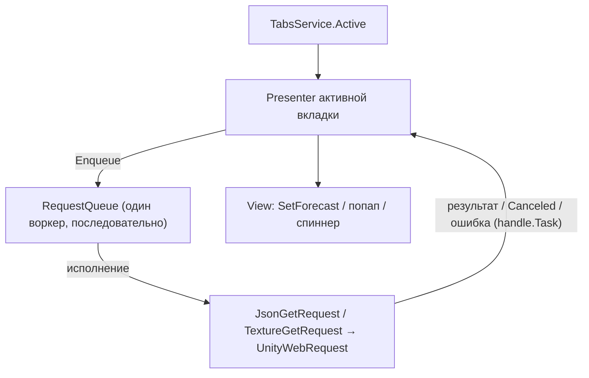

# Unity тестовое задание

Мобильное Unity-приложение с нижней навигацией на три вкладки (Кликер / Погода / Породы собак) и единой последовательной очередью HTTP-запросов.

## Стек

- Unity 2022.3 LTS (C# 9), портретная ориентация, reference resolution 1080×1920
- Zenject - весь DI
- UniTask - весь async
- UniRx - реактивное состояние и биндинги View/Presenter
- DOTween - анимации
- UnityWebRequest - HTTP (только внутри обёрток очереди)
- Newtonsoft.Json - парсинг JSON

Zenject и DOTween закоммичены целиком в `Assets/Plugins` (не через Package Manager), поэтому проект открывается и собирается без ручного импорта. UniTask, UniRx и Newtonsoft подтягиваются по `Packages/manifest.json`.

## Как запустить

1. Открыть проект в Unity 2022.3 LTS.
2. Открыть сцену `Assets/Scenes/Main`.
3. Нажать Play.

Canvas настроен на Scale With Screen Size, reference 1080×1920, портрет.

## Архитектура



### UI (MVP, Passive View)

View - MonoBehaviour без логики: `[SerializeField]`-ссылки, методы отображения и исходящие события. Presenter - чистый C# класс: связывает View с моделями и сервисами, владеет подписками и отменой запросов своей вкладки. Model/Service - чистый C#, состояние в `ReactiveProperty`.

### DI (Zenject)

Одна сцена `Main`, один `SceneContext`. Инсталлеры: `ConfigsInstaller`, `CoreInstaller`, `UiInstaller`, `ClickerInstaller`, `WeatherInstaller`, `BreedsInstaller`.

### Очередь запросов (Core/Network)

Единственная точка сети. Один воркер-цикл обрабатывает запросы строго последовательно: пока не завершится текущий, следующий не стартует. `Enqueue<T>` возвращает `IRequestHandle<T>` с `Task` и `Cancel()`.

Отмена запроса, ещё не взятого в работу: у элемента выставляется флаг отмены, физически из очереди он не убирается, но при попытке исполнения воркер видит отмену и пропускает его, не вызывая `Execute()`; `Task` переходит в Canceled.

Отмена исполняющегося запроса: `Cancel()` дёргает `CancellationTokenSource`, связанный с токеном воркера (`CreateLinkedTokenSource`), что прерывает `UnityWebRequest` внутри обёртки; `Task` также переходит в Canceled.

Ошибка или отмена одного элемента не останавливают воркер, он продолжает разбирать очередь дальше.

### Пулы и фабрики

Летящие «+1» (`FlyingCurrencyView`) и партиклы разлёта (`ClickerBurstView`) - Zenject MemoryPool (`FlyingCurrencyPool`, `ClickerBurstPool`), переиспользуются без роста числа инстансов в иерархии. Строки списка пород (`BreedRowView`) - `PlaceholderFactory` (`BreedRowView.Factory`).

### Сеть по фичам

Weather не заводит отдельный класс запроса: `WeatherPresenter` кладёт в очередь `JsonGetRequest<WeatherForecastResponse>` напрямую, с заголовками User-Agent и Accept. Breeds оборачивает `JsonGetRequest<T>` в тонкие `BreedsListRequest` / `BreedDetailsRequest`, чтобы скрыть построение URL из конфига.

## Структура папок

```
Assets/Scripts/
  Core/
    Network/    очередь запросов, IWebRequest, JsonGetRequest, TextureGetRequest
    Tabs/       TabType, TabsService
    Audio/      SoundService
  Configs/      ScriptableObject-конфиги (Clicker, ClickerVfx, Weather, Breeds)
  Features/
    Clicker/    валюта/энергия/автоклик, VFX-пулы, презентер, вью
    Weather/    DTO прогноза, презентер с поллингом, вью
    Breeds/     DTO (JSON:API), презентер списка/деталей, строка списка, вью
  UI/           таб-бар, попап, спиннер, интерфейс вкладки
  Installers/   Zenject-инсталлеры
```

## Соответствие ТЗ

| Требование | Где реализовано |
|---|---|
| Последовательная очередь запросов | `RequestQueue` |
| Добавление в очередь, получение результата | `IRequestQueue.Enqueue<T>` → `IRequestHandle<T>.Task` |
| Отмена запроса / удаление из очереди | `IRequestHandle.Cancel()`, `RequestHandle` |
| Кликер: +1 валюта за тап, стоимость 1 энергия | `ClickerService`, `CurrencyModel`, `EnergyModel` |
| Автосбор раз в 3с (со всеми VFX) | `AutoClicker` |
| Реген энергии +10/10с, cap 1000, старт 1000 | `EnergyModel` |
| VFX и звук, в том числе на автоклике | `ClickerService.ClickPerformed`, `ClickerPresenter`, `FlyingCurrencyView`, `ClickerBurstView`, `SoundService` |
| Счётчики валюты и энергии | `ClickerView` |
| Все значения из ScriptableObject | `ClickerConfig`, `ClickerVfxConfig`, `WeatherConfig`, `BreedsConfig` |
| Погода: запрос раз в 5с на активной вкладке | `WeatherPresenter` |
| Отмена запроса погоды при уходе с вкладки | `WeatherPresenter` |
| Иконка погоды через очередь + кэш | `WeatherPresenter`, `TextureGetRequest` |
| Список пород (10 шт.) + лоадер | `BreedsPresenter`, `BreedsView`, `BreedsListRequest` |
| Клик по породе: спиннер + попап с деталями | `BreedRowView`, `BreedDetailsRequest`, `PopupView` |
| Переклик отменяет предыдущий запрос деталей | `BreedsPresenter` |
| Уход с вкладки отменяет всё | `BreedsPresenter` |
| Общий попап с адаптивной высотой | `PopupView` (ContentSizeFitter + VerticalLayoutGroup) |
| Адаптивный UI под разные разрешения | Canvas Scaler (Scale With Screen Size) + anchors + layout group components |
